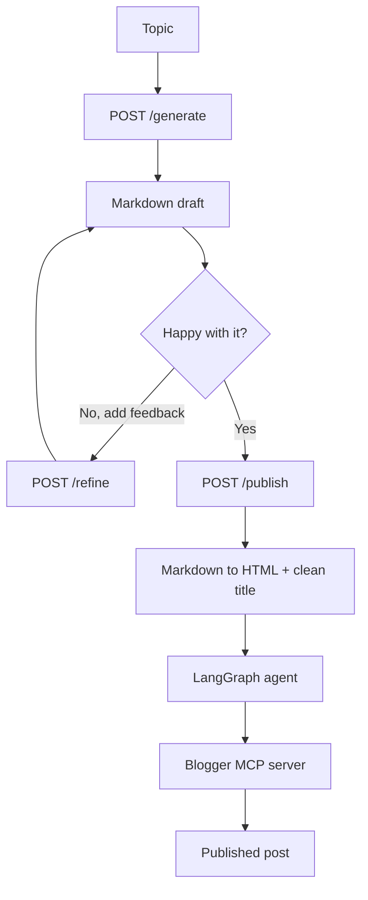
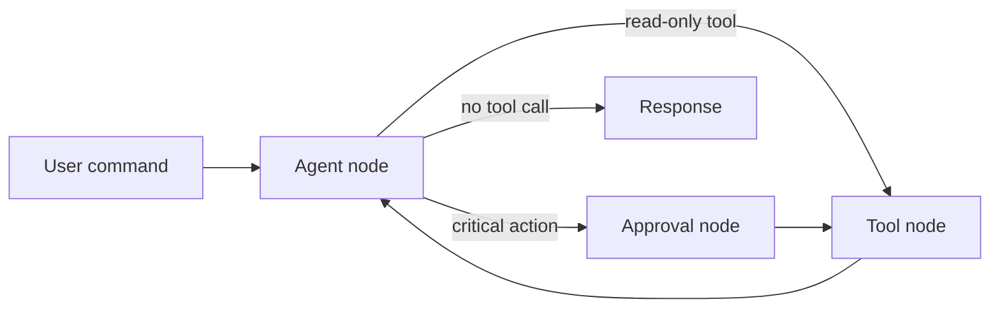

# 🤖 AI Blogger Automation System

An AI-powered blogging assistant. Give it a topic, review and refine the generated draft, then publish straight to Blogger. A built-in agent also lets you list, update and delete posts using plain English.


## Contents

- [Features](#-features)
- [How it works](#-how-it-works)
- [Screenshots](#-screenshots)
- [Tech stack](#-tech-stack)
- [Getting started](#-getting-started)
- [Blogger and Google setup](#-blogger-and-google-setup)
- [API reference](#-api-reference)
- [Configuration](#-configuration)
- [Known limitations](#-known-limitations)
- [Troubleshooting](#-troubleshooting)
- [Roadmap](#-roadmap)
- [Project structure](#-project-structure)
- [Contributing](#-contributing)
- [Credits and license](#-credits-and-license)

## ✨ Features

**Draft generation**
- Generates structured Markdown blog posts from a topic using Groq-hosted LLMs
- Optional featured image generated through Pollinations AI
- Markdown is converted to clean HTML before publishing

**Review and refinement**
- Preview the draft, give feedback, and regenerate as many times as you like
- The refine step receives the original topic, the previous draft and your feedback

**Publishing**
- Publishes to Blogger through a Blogger MCP server
- Generates a clean, readable title from your topic

**Blog management agent**
- Natural-language commands: list, create, update and delete posts
- Picks posts by recency or ID and lists posts before destructive actions
- Built on a LangGraph state machine with an approval step for critical actions (see [Known limitations](#-known-limitations))

## 🔄 How it works



The `/agent` endpoint feeds natural-language commands into the same LangGraph agent:



## 📸 Screenshots

### Draft generation


### Published post management


## 🧰 Tech stack

| Layer | Technology |
|-------|------------|
| Backend | FastAPI (Python) |
| Agent orchestration | LangGraph |
| LLM | Groq via `langchain-groq` (`openai/gpt-oss-20b`) |
| Blogger integration | Blogger MCP server (Node.js, stdio) via `langchain-mcp-adapters` |
| Images | Pollinations AI |
| Frontend | React 19, Vite 7, Tailwind CSS v4, Lucide icons |

## 🚀 Getting started

### Prerequisites

- Python 3.10+
- Node.js 18+
- A Google account with a Blogger blog
- A Google Cloud project with the Blogger API enabled ([setup below](#-blogger-and-google-setup))
- A [Groq API key](https://console.groq.com/)
- A Blogger MCP server built locally (Node.js, stdio transport)

### 1. Clone the repository

```bash
git clone https://github.com/aditya86-id/AI-Blogger-Automation-System-.git
cd AI-Blogger-Automation-System-/blogAgent
```

### 2. Backend

```bash
cd Backend
python -m venv .venv
source .venv/bin/activate        # Windows: .venv\Scripts\activate
pip install fastapi "uvicorn[standard]" python-dotenv langchain-groq langgraph langchain-mcp-adapters markdown
```

Create `Backend/.env`:

```env
BLOG_ID=your_blogger_blog_id
GOOGLE_CLIENT_ID=your_google_client_id
GOOGLE_CLIENT_SECRET=your_google_client_secret
GROQ_API_KEY=your_groq_api_key
```

Point the app at your Blogger MCP server by editing the `servers` dictionary in `init_workflow()` inside `app.py`:

```python
"command": "node",
"args": ["/absolute/path/to/blogger-mcp-server/dist/index.js"],
```

Start the API:

```bash
uvicorn app:app --reload --port 8000
```

The API runs at `http://localhost:8000`. Check `GET /health` to confirm it is up.

### 3. Frontend

```bash
cd ../Frontend
npm install
```

Create `Frontend/.env`:

```env
VITE_API_URL=http://localhost:8000
```

```bash
npm run dev
```

The app runs at `http://localhost:5173`.

## 🔐 Blogger and Google setup

<details>
<summary>Step-by-step instructions</summary>

1. **Create a project.** In the [Google Cloud Console](https://console.cloud.google.com/), create a project and enable the **Blogger API v3**.
2. **Configure the OAuth consent screen.** Under *APIs & Services > OAuth consent screen*, choose **External** and add these scopes:
   - `https://www.googleapis.com/auth/blogger`
   - `https://www.googleapis.com/auth/blogger.readonly`
3. **Create credentials.** Under *APIs & Services > Credentials*, create an **OAuth 2.0 Client ID** of type **Web application** with this authorized redirect URI:
   - `http://localhost:3000/oauth/callback`
4. **Save the client ID and secret** in `Backend/.env`.
5. **Find your Blog ID.** In the Blogger dashboard, open your blog and copy the numeric ID from the URL (or the settings page) into `BLOG_ID`.

</details>

## 📚 API reference

| Method | Endpoint | Purpose |
|--------|----------|---------|
| `POST` | `/generate` | Create a Markdown draft from a topic |
| `POST` | `/refine` | Revise a draft using feedback |
| `POST` | `/publish` | Convert a draft to HTML and publish it to Blogger |
| `POST` | `/agent` | Run a natural-language blog management command |
| `GET` | `/health` | Health check |
| `GET` | `/` | Service status |

**Generate a draft**

```http
POST /generate
Content-Type: application/json

{ "topic": "Why Rust is great for CLI tools", "include_image": false }
```

```json
{ "draft": "# Markdown content...", "evaluation": "Draft generated successfully. Ready for your review." }
```

**Refine a draft**

```http
POST /refine
Content-Type: application/json

{
  "original_topic": "Why Rust is great for CLI tools",
  "feedback": "Add a short code example",
  "previous_draft": "# Previous Markdown...",
  "include_image": false
}
```

**Publish**

```http
POST /publish
Content-Type: application/json

{ "title": "Why Rust is great for CLI tools", "content": "# Markdown...", "include_image": true }
```

**Agent command**

```http
POST /agent
Content-Type: application/json

{ "message": "List my 5 most recent posts" }
```

Example commands: "List all my blog posts", "Delete the most recent post", "Update the latest post with more examples".

## 🔧 Configuration

| Setting | Where | Notes |
|---------|-------|-------|
| LLM model and temperature | `ChatGroq(...)` calls in `app.py` | Any Groq model that supports tool calling works for the agent |
| Critical actions | `CRITICAL_ACTIONS` in `app.py` | Tool names that route through the approval node |
| Image size and model | `generate_image()` in `app.py` | Query parameters on the Pollinations URL |
| Markdown extensions | `markdown.markdown(...)` in `/publish` | Currently `extra` and `sane_lists` |
| Target blog | `BLOG_ID` in `.env` | Change it to manage a different blog |

## ⚠️ Known limitations

This project is a working prototype. Please read these before deploying it anywhere public:

- **Approval is not enforced yet.** The agent's approval node currently auto-approves critical actions. The draft review in the UI is the only real confirmation step before publishing.
- **No authentication.** The API has no auth and allows all CORS origins. Run it locally or behind your own auth layer, and do not expose `/agent` publicly.
- **Publish response is a placeholder.** `/publish` returns a fixed `postId` and blog URL rather than the real values from Blogger.
- **Local MCP path.** The Blogger MCP server is launched as a local subprocess, so the app is not deployable to serverless hosts as-is.
- **Draft HTML is not sanitized.** Markdown is converted to HTML as-is before publishing.

Fixes for these are tracked in the [roadmap](#-roadmap).

## 🐛 Troubleshooting

| Problem | Fix |
|---------|-----|
| MCP server not found / startup fails | Check the path in `init_workflow()` in `app.py` and that the server is built (`dist/index.js` exists) |
| Blogger API quota exceeded | Check quotas in the Google Cloud Console |
| Authentication failed | Recreate the OAuth credentials and update `.env`; confirm the redirect URI matches |
| Groq errors or empty output | Verify `GROQ_API_KEY` and that the model name is still available on Groq |
| Image not loading | Pollinations may be rate limiting; retry or swap the image provider |

## 🗺️ Roadmap

- [ ] Real human-in-the-loop approval (LangGraph `interrupt`) for delete, update and publish
- [ ] API authentication and restricted CORS
- [ ] Publish through the MCP tool directly and return the real post ID and URL
- [ ] HTML sanitization for generated content
- [ ] Hosted or HTTP-transport MCP server for deployment
- [ ] Scheduled publishing
- [ ] SEO scoring and title A/B suggestions
- [ ] Multi-platform publishing (WordPress, Medium, Dev.to)
- [ ] Draft versioning

## 📑 Project structure

```
AI-Blogger-Automation-System-/
├── blogAgent/
│   ├── Backend/
│   │   └── app.py          # FastAPI app and LangGraph agent
│   └── Frontend/           # React + Vite UI
├── docs/                   # Documentation assets
└── README.md
```

## 🤝 Contributing

Issues and pull requests are welcome.

1. Fork the repository
2. Create a branch: `git checkout -b feature/my-feature`
3. Commit your changes: `git commit -m "Add my feature"`
4. Push the branch: `git push origin feature/my-feature`
5. Open a pull request


---

⭐ If you find this useful, consider starring the repo. Found a bug or have an idea? Open an issue.
